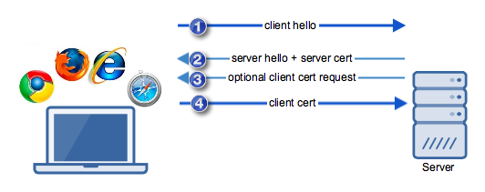

# Client Cert Authentication
## Overview
Client certificates as the name indicates are used to identify a client or a user. They are meant for authenticating the client to the server. In case of a client certificate the value of this field would be set to a users name.

A client digital certificate or client certificate is basically a file, usually protected with a password and loaded unto a client application (usually as PKCS12 files with the .p12 or .pfx extension).

Client certificate authentication (if ever applied) is carried out as part of the SSL or TLS handshake, an important process that takes place before the actual data is transmitted in a SSL or TLS session.

## SSL/TLS Handshake

First, the client performs a "client hello", wherein it introduces itself to the server and provides a set of security-related information. (Algorithms/Ciphers it can use).

The server responds with its own "server hello", which is accompanied with its server certificate and relevant security details based on the information initially sent by the client.

This is the optional step that initiates client certificate authentication. This will only be carried out if the server is configured to request a digital certificate from the client for the purpose of authentication.
Before this step is performed, the client inspects the server certificate for authenticity. If all goes well, it transmits additional security details and its own client certificate.

Only after both server and client have successfully authenticated each other (in addition to other security-related exchanges) will the transmission of data begin.

We know from An Overview of How Digital Certificates Work how the client is able to validate the server certificate and authenticate the server. So the remaining million-dollar question is - how does the server authenticate the client?

Just like in server certificate authentication, client certificate authentication makes use of digital signatures. For a client certificate to pass a server's validation process, the digital signature found on it should have been signed by a CA recognized by the server. Otherwise, the validation would fail.

## Client-authenticated TLS handshake in-depth
The following full example shows a client being authenticated (in addition to the server as in the example above) via TLS using certificates exchanged between both peers.

1. Negotiation Phase:
  * A client sends a ClientHello message specifying the highest TLS protocol version it supports, a random number, a list of suggested cipher suites and compression methods.
  * The server responds with a ServerHello message, containing the chosen protocol version, a random number, cipher suite and compression method from the choices offered by the client. The server may also send a session id as part of the message to perform a resumed handshake.
  * The server sends its Certificate message (depending on the selected cipher suite, this may be omitted by the server).[276]
  * The server sends its ServerKeyExchange message (depending on the selected cipher suite, this may be omitted by the server). This message is sent for all DHE and DH_anon ciphersuites.[1]
  * The server requests a certificate from the client, so that the connection can be mutually authenticated, using a CertificateRequest message.
  * The server sends a ServerHelloDone message, indicating it is done with handshake negotiation.
  * The client responds with a Certificate message, which contains the client's certificate.
  * The client sends a ClientKeyExchange message, which may contain a PreMasterSecret, public key, or nothing. (Again, this depends on the selected cipher.) This PreMasterSecret is encrypted using the public key of the server certificate.
  * The client sends a CertificateVerify message, which is a signature over the previous handshake messages using the client's certificate's private key. This signature can be verified by using the client's certificate's public key. This lets the server know that the client has access to the private key of the certificate and thus owns the certificate.
  * The client and server then use the random numbers and PreMasterSecret to compute a common secret, called the "master secret". All other key data for this connection is derived from this master secret (and the client- and server-generated random values), which is passed through a carefully designed pseudorandom function.

2. The client now sends a ChangeCipherSpec record, essentially telling the server, "Everything I tell you from now on will be authenticated (and encrypted if encryption was negotiated). " The ChangeCipherSpec is itself a record-level protocol and has type 20 and not 22.
  * Finally, the client sends an encrypted Finished message, containing a hash and MAC over the previous handshake messages.
  * The server will attempt to decrypt the client's Finished message and verify the hash and MAC. If the decryption or verification fails, the handshake is considered to have failed and the connection should be torn down.

3. Finally, the server sends a ChangeCipherSpec, telling the client, "Everything I tell you from now on will be authenticated (and encrypted if encryption was negotiated)."
  * The server sends its own encrypted Finished message.
  * The client performs the same decryption and verification.

4. Application phase: at this point, the "handshake" is complete and the application protocol is enabled, with content type of 23. Application messages exchanged between client and server will also be encrypted exactly like in their Finished message.

