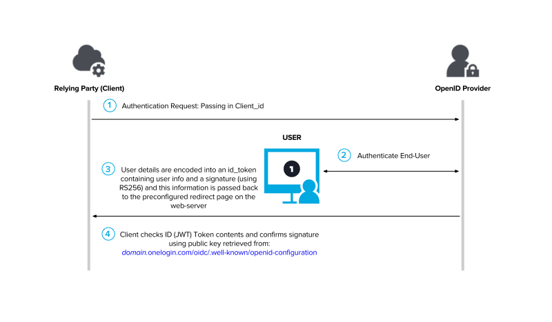

# OpenID-Connect

## OIDC Basics

At the highest level, OIDC is simply a secure mechanism for an application to contact an identity service, get some user details, and return them to back to the application in a secure way.

At its core, OpenID Connect started its life as a ‘consumer grade’ OAuth authorization mechanism — which is a fancy way of saying “it’s designed around granting another application permission to do stuff.”

So it has a lot of the details that OAuth has, such as a client_id and client_secret as well as a redirect_uri that are stored by the identity provider. All of which are designed to make sure a specific client will only pass back information to the proper application. Basically this prevents someone from stealing a client_id and using it to start and OIDC flow that redirects information back to www.evil_hacker.com

Anyone who’s ever used a Facebook “What online quiz best describes you?” app has seen the OAuth portion of this in action - You’re directed to the identity provider (in this case, Facebook) to log-in and from there it asks your permission to look at various aspects of your facebook profile.

At the end of the day, these permissions are called “scopes” (As in “what’s the scope the personal information I’m willing to give to this app?”) and there’s a special scope for OIDC called… openid that must be passed in as part of this first call to the identity provider (which we’ll call just “provider” from here on out for simplicity and to stick with OIDC convention).

The next question, now that the scope has been defined as “I want to do the openid thing” and the application has passed in a valid client_id & redirect_uri, is “How do I want to do the openid thing”?

And that brings us to Open ID Connect flows.

## Go with the flow

The type of OpenID Connect flow you should use has a lot to do with the type of client you’re using and how well it can keep a secret.

For example, if you’re using a JavaScript application, where anything and everything can be looked at by someone using browser development tools, and there’s no ‘back end’ logic in the web server that can do things away from the prying eyes of users… You must use the Implicit flow for OpenID Connect.

Now, if you’re using a more traditional application, where some information is passed around on the front end (and anyone can peek at it) but it also has back end code that can talk to the provider in secret, you can use the Authentication Flow (although you don’t have to)

And there’s also a Hybrid Flow, but at the end of the day, that’s just a combination of both flows.

### A. Implicit Flow

This flow is designed to pass basic information about the user to the application and that’s about it.

Well, not really.

The OIDC spec is very specific about how the user information requested (by various scopes) should be encoded in a JWT (JSON Web Token), and that it should be either encrypted or signed and information about [how and when this was done](https://tools.ietf.org/html/rfc7517) must be included as part of the payload that’s sent back.

But ultimately the requirements for the implicit flow are that it must use a public / private key scheme to encrypt or sign user details. And that the client_secret should never be exposed.

This way the application can determine the user details (called claims in OIDC) are from a legitimate source (not a spoofed redirect from www.evil_hacker.com) and at the same time make sure no truly private information (like the client_secret) is revealed to prying eyes.

Basically, anyone can “steal” the public key and client id but that doesn’t matter as only the provider has the proper information (the redirect uri and the private key) to use these correctly.

### B. Authentication Flow

This flow is designed to function like a traditional, three-legged OAuth and results in a traditional OAuth access token being returned in secret to the web application via calls made on the back end, away from the prying eyes of the front-end client.

In this flow, rather than transmit the user details, the provider sends a special, one-time-use code that can be exchanged by the back-end web service for an OAuth access token. This exchange needs to include the client_id and client_secret in addition to the code, just like a traditional OAuth 2.0 flow.

This OAuth access token should then be used by the web service to confirm the code is legit, and this token can also be used to ask for various types of user information (these standard user attributes are defined by the types of scopes & claims requested)

In the world of identity providers, these claims are usually pre-approved by the admin configuring the application, but in the consumer world (where the end-user is approving the application’s access) these claims appear as permission requests (scopes) during the initial application flow.

OIDC defines a whole slew of claims and some are quite narrowly defined (for example, just the user’s email) but others are quite broad and may return information that’s particular to the provider (such as a user’s profile)

Finally, some OIDC providers also allow for an OAuth refresh token (if the web service desires longer term access to the user information) as well as custom claims.

### C. Hybrid Flow

This just combines the behavior of the other two flow types, with one small improvement: This flow also allows for an access token to be passed back directly to the client.

It’s generally accepted that this ‘front channel’ access token isn’t quite as secure as a ‘back channel’ token, so sometimes these are shorter lived and the life of one of these tokens can only be extended through back-channel calls.

## Well Known Endpoint

You have probably noticed by now that the client needs to know quite a bit of information about the provider in order to properly do all the various OIDC handshakes and exchanges. Plus there’s the question of where it should go to grab the public keys used to sign or encrypt this information.

To streamline this process, OIDC providers can support the ‘well known’ endpoint. Here, OIDC defines a set of values that can be retrieved by a client in order to self-configure. And while some of this information is unlikely to change, other pieces are expressly designed to be updated periodically.

Ex. If you look at https://accounts.google.com/.well-known/openid-configuration you’ll find an entry for “jwks_uri”: “https://www.googleapis.com/oauth2/v3/certs”

This jwks_uri value is a URI a client can access to get information on all the JWK keys used by Google, in a format specified by part of the OIDC spec.

And one of the values returned for each key is a key id (kid) which can be used to quickly determine if the crypto key has changed.

Long story short, by checking this value, a client can determine if the provider has changed its public key since the last time it used it and automatically update itself to use this new information.

Basically, this gives us automatic key rotation. Take that SAML!

## Summary.

I’ll be the first to admit that I’ve glossed over quite a lot of the minutia and specifics of these flows, but far better experts than I have delved into these details and the official spec has everything you’ll need as you get into the specific formats required.

Plus, the OpenID foundation has build some nice tools to help you experiment, once you’re getting started.

But I hope that at the very least I’ve given you the overall sense of the fundamentals.

Lastly, this is a standard. Which means lots of OIDC clients have already been developed for it. There’s not much need to roll your own, but now that you understand the flows and how they work, just make sure you pick the right type for your use case!

[Reference](https://www.onelogin.com/blog/openid-connect-explained-in-plain-english)