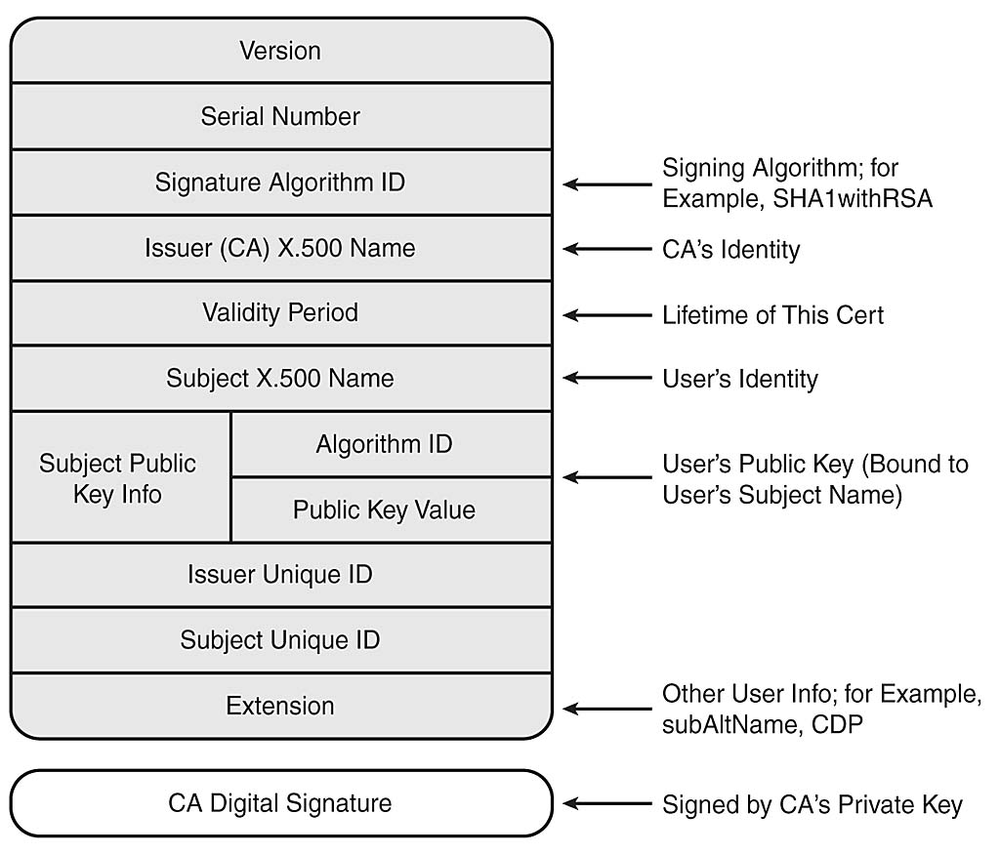

# Certificates

## Overview
* A certificate is an electronic document that binds an entity (e.g. individual) to a public key
* Signed by a third party called a Certificate Authority (CA)
* Conforms to a standard, usually X.509
* Certificate user trusts CA to issue valid certificates.
* CA’s public key may be validated by another (e.g. higher-level) CA

A Digital Certificate doesn’t last for ever:

* It normally expires after a certain time and must be renewed
* It may be revoked:
  * If the subject’s private key is compromised
  * If there is a change in status of the subject
  * If the CA’s private key is compromised
* Revoked Certificates are placed on a
Certificate Revocation List (CRL)

## X.509 Cert Structure

## Certificate Pinning

